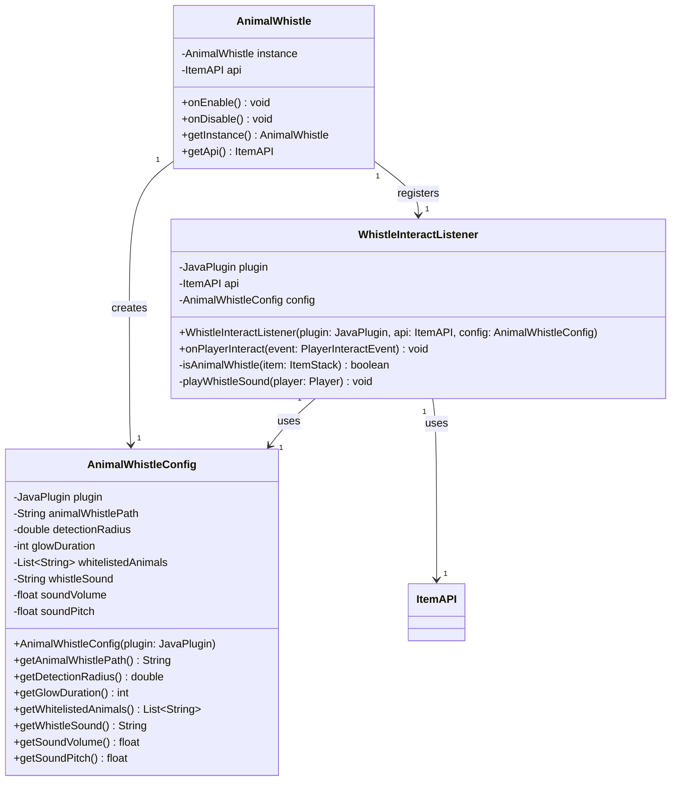

# AnimalWhistle

A Minecraft Paper plugin that lets players use a special whistle item to highlight nearby animals with a glowing effect.

## Features

- Right-click with the **Animal Whistle** item (from Items Adder, MMOItems or Vanilla) to detect nearby animals within a configurable radius
- Highlighted animals glow for a configurable duration
- Plays a configurable sound when the whistle is used
- Whitelist of entity types that will be affected

## Architecture

The plugin follows a simple modular architecture with clear separation of concerns:



### Component Descriptions

- **AnimalWhistle**: Main plugin class that initializes the ItemAPI and registers the event listener
- **AnimalWhistleConfig**: Configuration manager that loads and provides access to all plugin settings
- **WhistleInteractListener**: Event listener that handles right-click interactions with the whistle, validates the item, plays sound, and applies glowing effects to nearby whitelisted animals

## Dependencies

| Dependency | Required |
|---|---|
| [Paper](https://papermc.io/) 1.21+ | Yes |
| [TLibs](https://www.spigotmc.org/resources/tlibs.127713/) | Yes |
| [MMOItems](https://www.spigotmc.org/resources/mmoitems-premium.39267/) | No |
| [ItemsAdder](https://itemsadder.com/) | No |

## Installation

1. Place `AnimalWhistle.jar` into your server's `plugins/` folder
2. Make sure that **TLibs** is also installed. **MMOItems** and **Items Adder** are optional
3. Reload the server or Enable `animalwhistle-1.0.0` with PlugManX
4. Configure `plugins/AnimalWhistle/config.yml` as needed

## Configuration

```yaml
# Item path
items:
  animal-whistle: "m.pets.animal_whistle"
  # Vanilla item example: "v.iron_ingot"
  # ItemsAdder item example: "ia.tfmc.animal_whistle"

# Feature settings
settings:
  detection-radius: 64.0    # Radius in blocks to detect animals
  glow-duration: 5          # Duration in seconds for the glowing effect
  whitelisted-animals:      # Entity types that will be highlighted
    - HORSE
    - DONKEY
    - MULE
    - LLAMA
    - TRADER_LLAMA

# Sound settings
sound:
  type: "ITEM_GOAT_HORN_SOUND_6"
  volume: 4.0               # 1 Volume = 16 blocks of range (in this case, 64 blocks)
  pitch: 2.0                # Range between 0.5 (half speed) and 2.0 (double speed)
```

### Configuration Options

| Key | Default | Description |
|---|---|---|
| `items.animal-whistle` | `m.pets.animal_whistle` | item ID for the whistle |
| `settings.detection-radius` | `50.0` | Block radius to scan for animals |
| `settings.glow-duration` | `5` | Seconds the glow effect lasts |
| `settings.whitelisted-animals` | See above | Bukkit `EntityType` names to highlight |
| `sound.type` | `BLOCK_NOTE_BLOCK_FLUTE` | Bukkit sound name played on use |
| `sound.volume` | `1.0` | Sound volume |
| `sound.pitch` | `1.5` | Sound pitch |

## Author

Justin - TFMC
[Donation Link](https://www.patreon.com/c/TFMCRP)